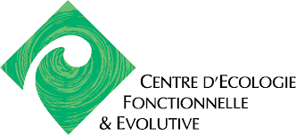
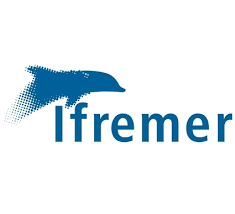

```{r setup_teaching, include=FALSE}
knitr::opts_chunk$set(echo = TRUE, cache = TRUE)
```


 </img>
  
  
## Context 
  Understanding the functionning and the dynamics of living organisms has lead in the last twenty years to the emergence of cross connected areas of research like biologging and movement ecology. These fields of reasearch are based on growing fluxes of observations,either in marine or in terrestrial sytems, which have been made possible through the broad development of electronic devices allowing to track and monitor foraging individuals like mammals, bird, vessels, or plant gatheres.

## Ecosystem 

Trajectories analyses is a meeting point between mathematics and ecology. There are several mathematical formulations of trajectory and many models to capture associated movement dynamics. Furthemore, statisticians have developed various statistical methods and framework that allow parameter estimation of these models given specific conditions.


## Objectives

 However specific features of monitoring data and of the various underlying processes of movements that are used make often difficult the straight application of existing operational methods. Furthermore the assumptions made in such statistical framework might be too restrictive from an ecological perspective and the models/approach would be largely improved by relaxing some of these assumptions.

Therefore, stimulating the meeting of key issues in ecology and relevant mathematical methods for analysing trajectories is still a prevailing challenge to improve the analysis of movement and identify the main future directions of models development.

The network objectives:

- Increasing the interactions between research networks developing or using statistical tools dedicated to the analysis of trajectories;
- Sharing the expertises and drawing up a state of art in trajectories modelling (Hidden Markov models, semi-hidden Markov models, Change point detection, random walks, etc.);
- working on future methodological developments required to
    - perform models validation
    - move from discret to continuous approaches
    - upscale analyses from individual-based to population-based approaches
    
    


## Supporting Organizations

|  | |  | |  |
|:-------------:|:-------------:|:-------------:|:-------------:|:-------------:|
| </img>|  </img> | </img> |  </img>| 
|  </img>| </img> | </img> |


  
    